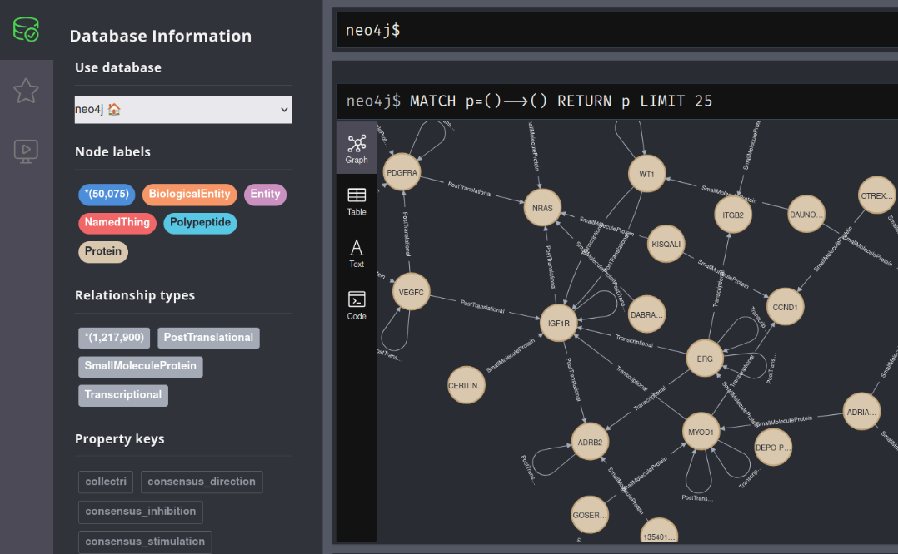

# Omnipath Secondary Adapter

This repository contains the scripts to run OntoWeaver and BioCypher for the creation of knowledge graphs from the OmniPath database. The project is currently under development. 

## Overview

The repository contains an Ontoweaver mapping file that serves as a BioCypher "secondary adapter" for OmniPath database. The adapter includes predefined sets of node types (entitites) and edge types (relationships) for the diffrent tables of Omnipath database (*Networks*, *Enzyme-PTM*, *Complexes*, *Annotations*, *Intercell*). A script is also provided to run OntoWeaver and BioCypher to create the knowledge graph. 

## About OmniPath

[Omnipath](https://omnipathdb.org/) is a database of molecular biology prior knowledge developed in [Saez Lab](https://saezlab.org/) and [Korcsmaros Lab](https://www.earlham.ac.uk/korcsmaros-group). It combines data from more than 100 resources and contains:

-  **protein-protein** and **gene regulatory** interactions
-  **Enzyme** and **Post-Translational-Modifications(PTM)** relationships
-  **Protein complexes**
-  **Protein annotations** 
-  **intercellular communication**.

Omnipath database stores the information in five different tables containing the aforementioned data.
- *Networks*
- *Enzyme-PTM*
- *Complexes*
- *Annotations*
- *Intercell*

#> [!WARNING]
#> This BioCypher adapter relies on the Ontoweaver library that works with Python 3.12. Ensure the #Python version is 3.12 in your virtual environment. 


## About this adapter

The main goal of this adapter is to enable users to retrieve data from the Omnipath database and use that information to generate a knowledge graph. For achieving this goal, we are going use BioCypher and OntoWeaver.

- [BioCypher](https://biocypher.org/):it  is a framework for building biomedical knowledge graphs by integrating heterogeneous data into a structured, ontology-aligned graph representation.

- [OntoWeaver](https://github.com/oncodash/ontoweaver): it is a visual and declarative ontology-based tool for designing and managing data integration systems, enabling intuitive schema mapping and semantic consistency. OntoWeaver has been built built on top of Biocypher.


## Prerequisites
- *Python 3*
- *Poetry* [recommended]: Python packaging and dependency manager.
  - [Install Poetry](https://python-poetry.org/docs/#installation)
- *git*: version control manager
  - [Install git](https://git-scm.com/book/en/v2/Getting-Started-Installing-Git)

| Prerequisite    | Version   | Verify installation      | How to install?                                                       |
| --------------- | --------- | ------------------------ | --------------------------------------------------------------------- |
| *Python 3*      | >=3.12    | ```$ python --version``` | [link](https://docs.python.org/3/using/index.html)                    |
| *Poetry*        | 1.8       | ```$ poetry about```     | [link](https://python-poetry.org/docs/1.8/#installation)              |
| *git*           | >= 2.0    | ```$ git --version```    | [link](https://git-scm.com/book/en/v2/Getting-Started-Installing-Git) |
| *Neo4j server*  | 2025.04.0 | ```$ neo4j --version```  | [link](https://neo4j.com/docs/operations-manual/current/installation/)                                    |

## Usage

1. Clone this repository and change to the directory:
```bash
git clone https://github.com/biocypher/omnipath-secondary-adapter
cd omnipath-secondary-adapter
```
2. Install all the dependencies (pre-configured in the *pyproject.toml* file):
```bash
poetry lock
poetry install --no-root
```

3. This current implementation generates Neo4j scripts for each table in the Omnipath database

| **Omnipath table** | **Script parameter**              | **Neo4j script generation** |
| ------------------ | :-------------------------------- | :-------------------------: |
| *Networks*         | ```-net``` or ```--networks```    |           ✅ Done            |
| *Enzyme-PTM*       | ```-enz``` or ```--enzyme-PTM```  |           ✅ Done            |
| *Complexes*        | ```-co``` or ```--complexes```    |           ✅ Done            |
| *Annotations*      | ```-an``` or ```--annotations```  |           ✅ Done           |
| *Intercell*        | ```-inter``` or ```--intercell``` |        ✅ Done          |

Use the following commands to generate import scripts for each Omnipath table:

### *Networks*
```bash
poetry run python weave_knowledge_graph.py -net download
```

### *Enzyme-PTM*
```bash
poetry run python weave_knowledge_graph.py -enz download
``` 

### *Complexess*
```bash
poetry run python weave_knowledge_graph.py -co download
```

### *Annotations*
```bash
poetry run python weave_knowledge_graph.py -an download
``` 

### *Intercell*
```bash
poetry run python weave_knowledge_graph.py -inter download
``` 

<a id="step-4"></a>
4. Once the script has processed the data, you can verify a folder has been generated under `biocypher-out`. The folder is named after the created date (e.g., `20250610172616`). This folder contains the following:

- `neo4j-admin-import-call.sh`: script to import the the data in Neo4j.
- CSV files:
  - ```*-header.csv```: indicate the node/edge properties fields
  - ```*-part000.csv, *-part001.csv,...```: store nodes/edges data based on the structure indicated in the ```*-header.csv``` files.

5. Stop the running instances of Neo4j by running:
```bash
sudo neo4j stop
```

6. Run the import script generated by step [4](#step-4).
```bash
sudo bash biocypher-out/<datetime>/neo4j-admin-import-call.sh
```

7. Start again Neo4j by running:
```bash
sudo neo4j start
``` 

8. Open the Neo4j platform on http://localhost:7474. You will be ask for credentials. By default the Neo4j credentials are:
   
- Database User: `neo4j`
- Password: `neo4j`

Note: change the password as requested.

9.  At the end, you have you Knowledge Graph! 🎉 Congratulations!

